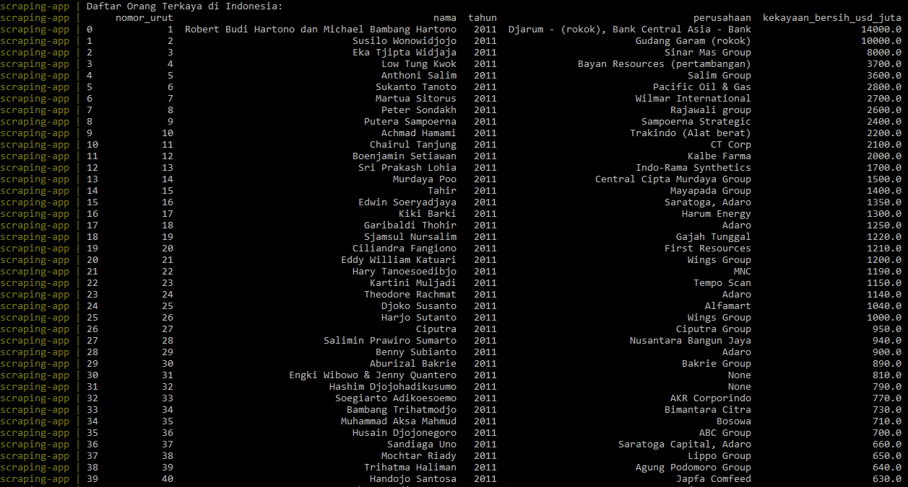
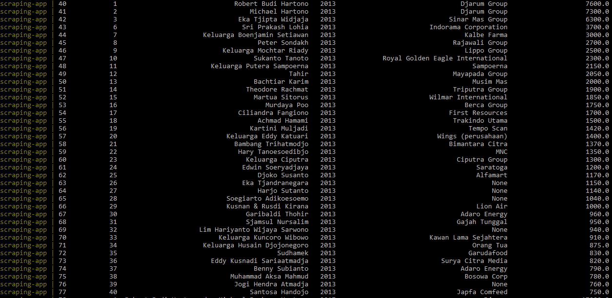
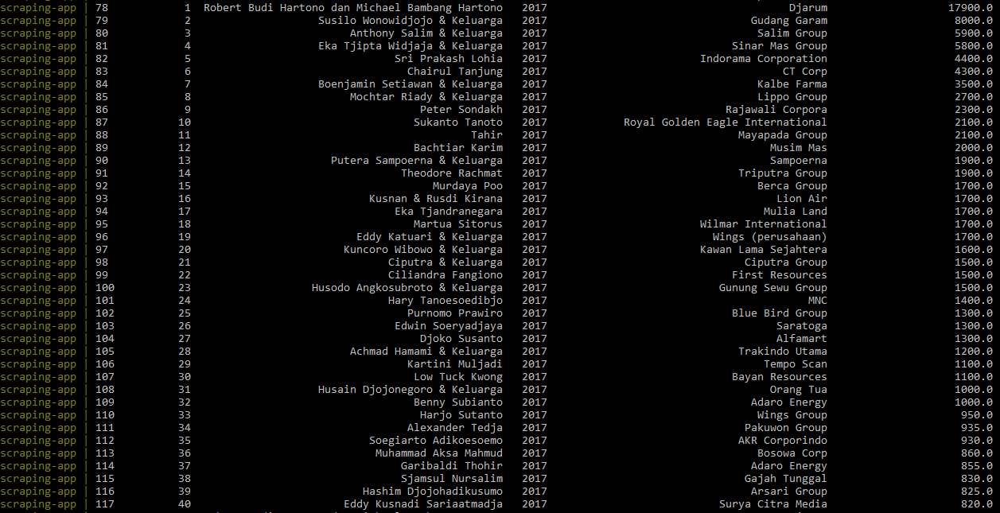
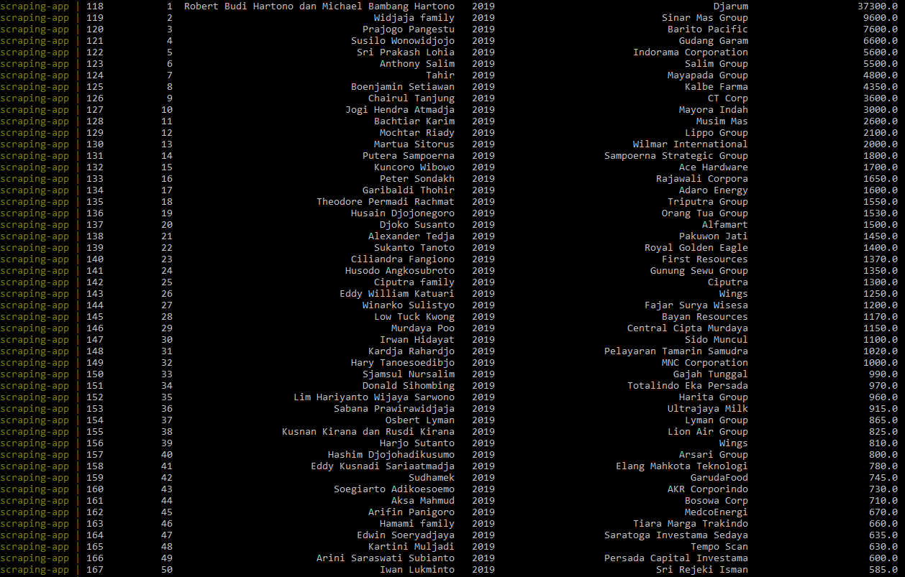
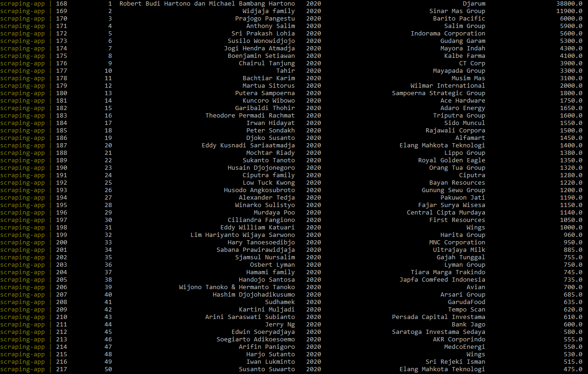

# ETL Scraping Data From Web and Stored to Postgres Database

## Web Scraping 
- url:  ```https://id.wikipedia.org/wiki/Daftar_orang_terkaya_di_Indonesia```

## Requirements
- Docker

## How to Run
- build docker image dengan command  `docker-compose -f docker-compose.yml build`
- jalankan aplikasi dengan command  `docker-compose -f docker-compose.yml up`
- matikan aplikasi dengan command  `docker-compose -f docker-compose.yml down`

## Sample Output
#### Year - 2011

#### Year - 2013

#### Year - 2017

#### Year - 2019

#### Year - 2020

